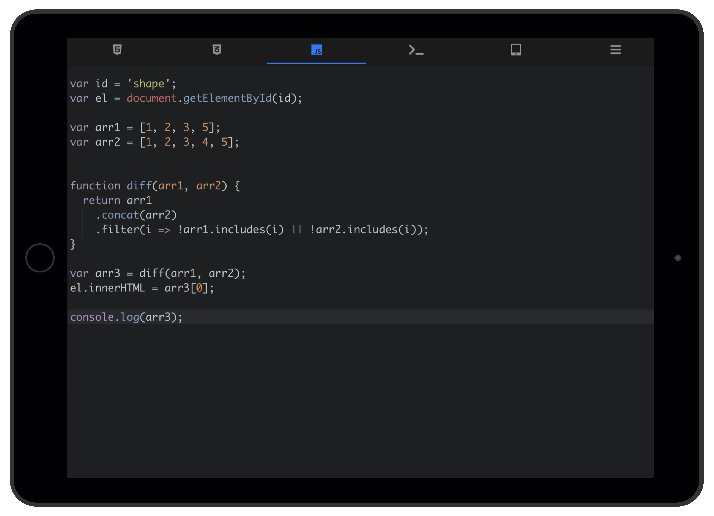

[WebDen.dev](https://webden.dev) is an open source mobile and tablet friendly alternative to JSFiddle and JSBin.
It is a fully client-side app so you can install it as a progressive web app (PWA) on
your device to use offline.

## Features

* HTML, CSS & JS editors
* JavaScript console emulation
* Preview panel
* Designed first for mobile and tablet use
* Import and export projects
* Save code as HTML
* Light & dark themes
* Keyboard shortcuts
* Offline support

## Why?

The landscape of online editors aren't currently optimized for mobile or tablet. The iOS apps
in this space have improved but were limited when this project originally started.

## How to install

**iOS Safari**

Go to *Share Menu > Add to Home Screen*

**Chrome**

Go to *Settings > Add to Home Screen*

## How to use libraries or frameworks

Add any scripts to the HTML tab as you would in a HTML file.

## Coming Soon

* Save as Github Gist
* Pushing / Pulling repos from Github
* Updated console features
* Updated editor theme features
* Capture JavaScript errors (for console)

## Thanks!

* [Ace](http://ace.c9.io)
* [Framework7](http://framework7.io/)
* [RenderJSON](https://github.com/caldwell/renderjson)
